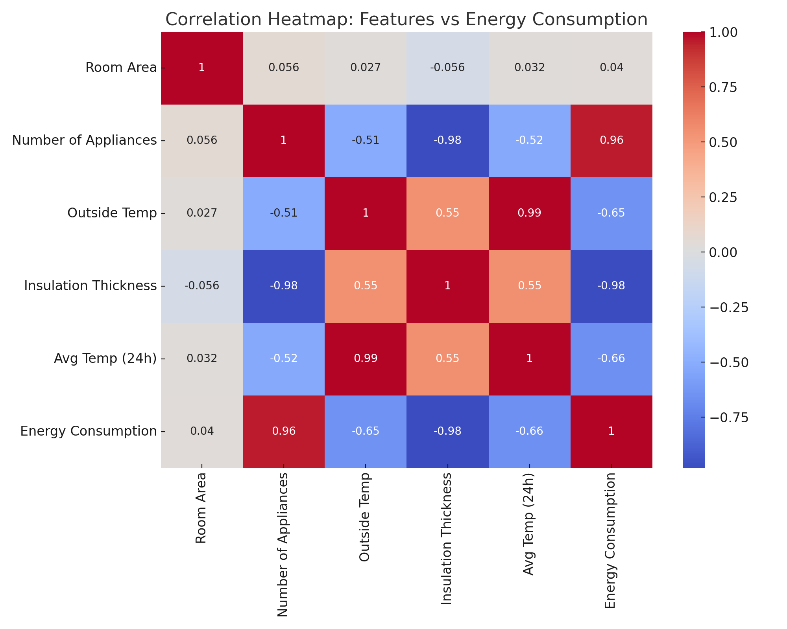
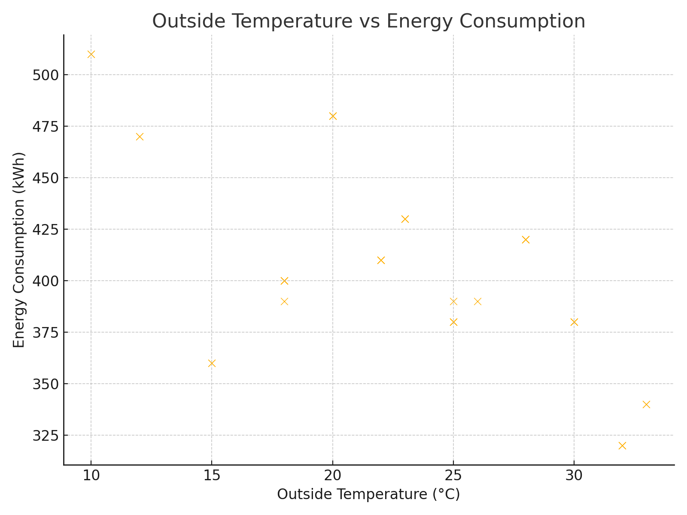
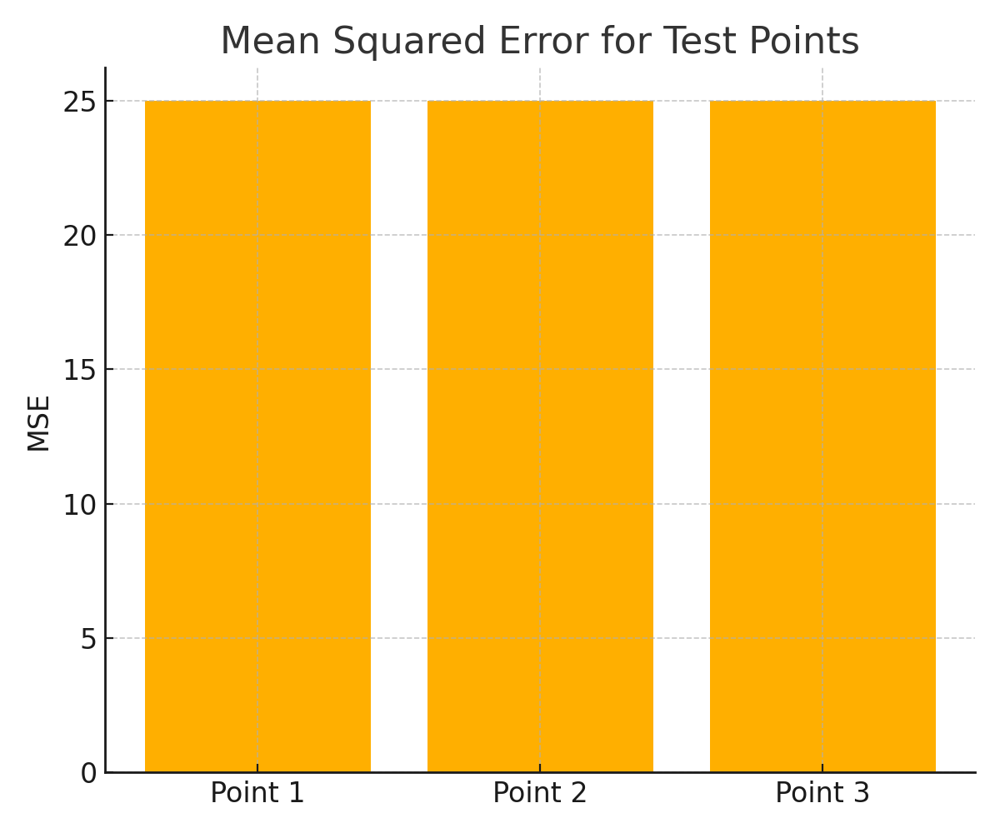

# SmartEnergyML-Predicting-Building-Energy-Consumption-with-Machine-Learning

This project focuses on predicting energy usage in buildings using HVAC-related data. We apply regression and classification techniques to identify which features most influence consumption and evaluate model accuracy using MSE (Mean Squared Error).

---

## 📁 Files in the Project

| File Name            | Description                                                                 |
|----------------------|-----------------------------------------------------------------------------|
| `Software.ipynb`     | Jupyter Notebook with all code, analysis, and visualizations                |
| `Dataset.csv`        | HVAC and building dataset used for training and evaluation                  |
| `correlation_heatmap.png` | Heatmap showing feature correlation with energy usage                  |
| `scatter_outside_temp.png`| Scatter plot of outside temp vs consumption                            |
| `mse_comparison.png` | Bar chart showing MSE for test points                                       |
| `README.md`          | This documentation file                                                     |

---

## 🧠 Objectives

- Discover which features impact energy use the most
- Train a Multiple Linear Regression (MLR) model
- Use K-Nearest Neighbors (KNN) to classify patterns
- Visualize key relationships between features and energy use
- Recommend strategies to optimize energy consumption

---

## 🧪 Dataset Overview

The dataset includes:
- Room Area (sqft)
- Number of Appliances
- Outside Temperature (°C)
- Average Temperature (24 hrs)
- Insulation Thickness (inches)
- HVAC System Type
- Building Type

---

## 📊 Visual Insights

### 🔶 Correlation Heatmap

This heatmap reveals how each feature relates to energy usage.

📷 `correlation_heatmap.png`  

- **Outside Temp** and **Avg Temp (24h)** show strong correlations with energy use.
- **Insulation Thickness** has weak correlation — less useful for prediction.

---

### 🔷 Scatter Plot – Outside Temp vs Energy Consumption

📷 `scatter_outside_temp.png`  

This plot confirms that as **Outside Temp** rises, so does **energy usage** — HVAC systems likely work harder in extreme weather.

---

### 🔺 MSE Comparison (Model Evaluation)

📷 `mse_comparison.png`  

This chart shows **Mean Squared Error** for 3 test predictions.  
- Lower MSE = better accuracy  
- Used to assess the performance of the regression model

---

## 🤖 ML Models Used

### ✅ Multiple Linear Regression (MLR)
- Predicts energy consumption using Room Area, Outside Temp, HVAC Type, etc.
- Trained with scikit-learn
- Accuracy evaluated using **MSE**

### ✅ K-Nearest Neighbors (KNN)
- Classifies data points based on their neighbors
- Explores decision boundary behavior at different K values

---

## 💡 Recommendations

- Drop weak features like **Insulation Thickness**
- Focus on dynamic features like **Outside Temp** and **24hr Avg Temp**
- Consider real-time sensor data in future work for smarter models

---

## 🧑‍💻 How to Run This Project

1. Clone the repository or download the ZIP.
2. Open `Software.ipynb` in **Jupyter Notebook** or **Google Colab**.
3. Ensure `Dataset.csv` is in the same directory.
4. Run the cells to generate outputs and visualizations.

---

## 🔮 Future Work

- Add time-series forecasting using LSTM or ARIMA
- Use real-time IoT data for adaptive learning
- Test performance across different building types and locations

---

## ✍️ Author

**[Your Name]**  
Course: BUSI 651 – Advanced Data Analytics  
University Canada West

---
